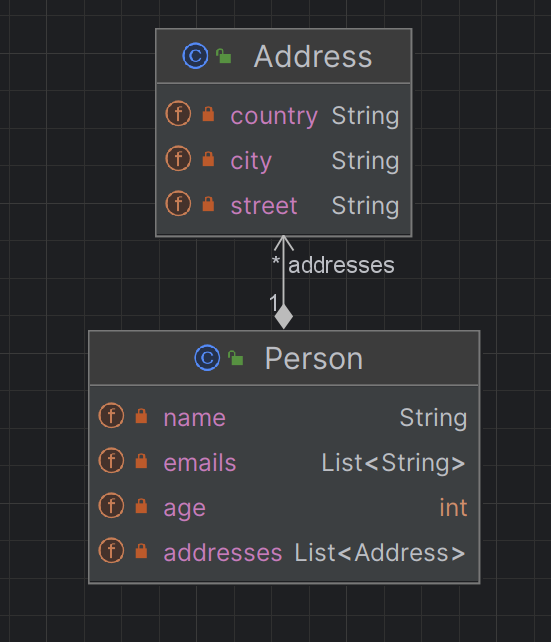
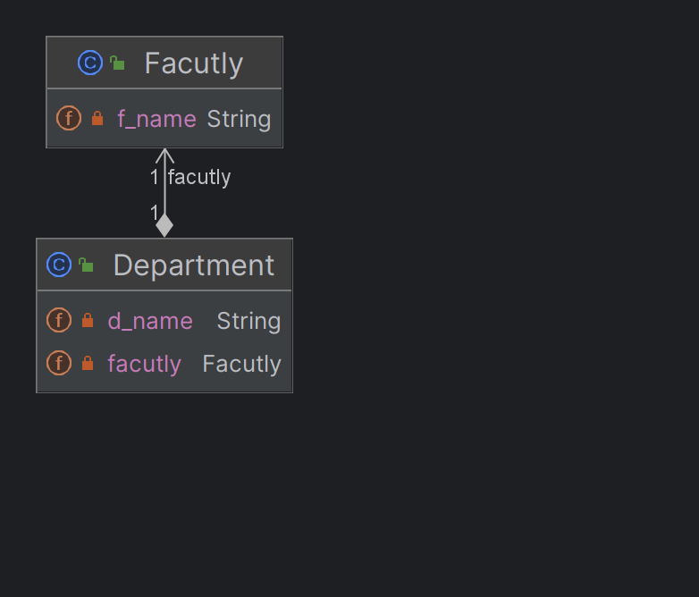
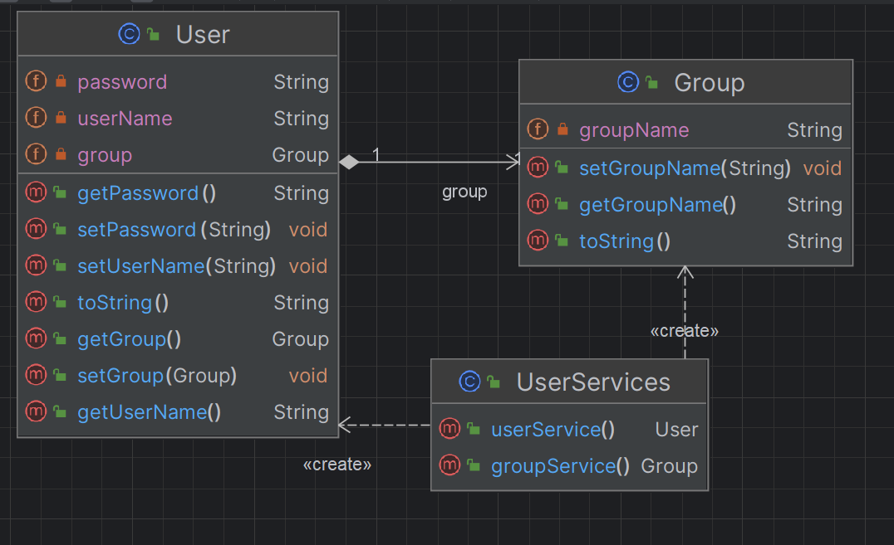
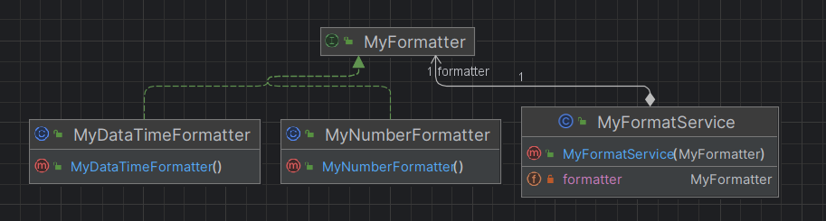
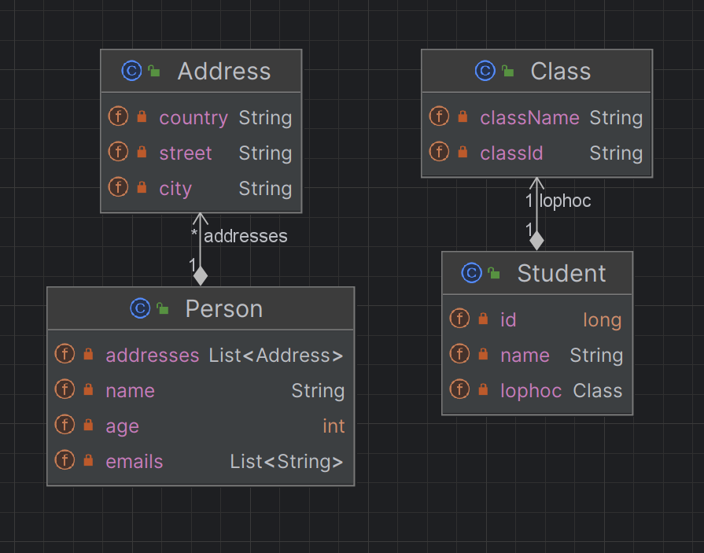

# www-lab-week04

# spring-ecosystem
> Spring Framework Core  
> Dependency injection (DI)  
> The Spring’s IOC Container  
> Spring Bean  
> Spring Bean Scope  
> Configuring Beans in the Container  
> Configuring Beans in the Container  
> XML-Based Configuration  

## ERD Diagram
> Spring Beans scope
> 

> Collection Injection
>

> Spring’s Auto-wiring
>

> Configuring Beans in the Container Java-Based Configuration
>

> @Autowired xml config
>

>
> @Autowire Disambiguation
>

>
> XML-Based Configuration
>

